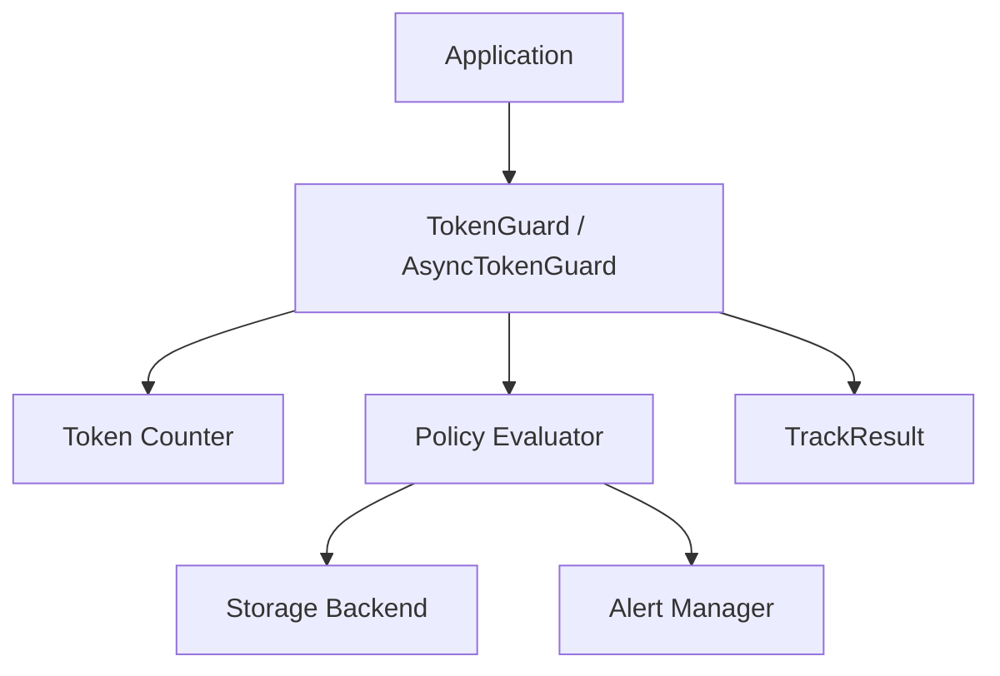

<p align="center">
  
</p>

# TokenGuard

Production-ready token tracking, policy evaluation engines, budget limits, and alerts for LLM applications.

[](https://pypi.org/project/llm-token-guard/)
[](https://www.python.org/)
[](LICENSE)
[](https://github.com/abhijitgunjal/token_guard/actions)

---

## ⚡ Quick Start

```python
# Sync exact tracking with a Sliding Window Policy
from token_guard import TokenGuard, SlidingWindowPolicy

policy = SlidingWindowPolicy(limit=50_000, window=3600)
guard = TokenGuard(policy=policy)
result = guard.track_usage("alice", input_tokens=42, output_tokens=15)

print(result.total_tokens)                  # 57
print(result.limit_exceeded)                # False
print(result.cumulative_usage.total_tokens) # 57

# Async exact tracking with Token Bucket Policy
from token_guard import AsyncTokenGuard, AsyncTokenBucketPolicy

async_policy = AsyncTokenBucketPolicy(capacity=10_000, refill_rate=100.0)
async_guard = AsyncTokenGuard(policy=async_policy)
result = await async_guard.track_usage("bob", input_tokens=42, output_tokens=15)

print(result.total_tokens)                  # 57
print(result.limit_exceeded)                # False
```

---

## Table of Contents

- [Why TokenGuard?](#why-token-guard)
- [Architecture](#architecture)
- [Features](#features)
- [Installation](#installation)
- [Documentation Guides](#documentation-guides)
  - [Policy Engine](docs/policies.md)
  - [Token Counting & Providers](docs/providers.md)
  - [Storage Backends](docs/storage.md)
  - [FastAPI Integration](docs/fastapi.md)
  - [Async Support](docs/async.md)
  - [Custom Backends](docs/custom-backends.md)
- [Provider Compatibility](#provider-compatibility)
- [Project Structure](#project-structure)
- [Examples](#examples)
- [Running Tests](#running-tests)
- [Roadmap](#roadmap)
- [Contributing](#contributing)
- [License](#license)

---

## 🧠 Why TokenGuard?

LLM calls are billed per token (inputs + outputs). Unchecked application consumption can quickly lead to unexpected cost spikes, upstream API rate-limiting blockages, or abuse.

**TokenGuard** acts as a lightweight, thread-safe, and event-loop-safe middleware layer. Use it to:
*   **Evaluate Flexible Policies**: Enforce Sliding Window, Token Bucket, Fixed Window, Leaky Bucket, Cost, Quota, or Role-based policies.
*   **Prevent Cost Spikes**: Set and enforce strict token usage budgets per user, model, or session.
*   **Unify Tracking**: Track consumption across OpenAI, Groq, OpenRouter, and AWS Bedrock under a single API.
*   **Flexible Storage**: Keep track in-memory (dev) or plug in Redis or SQLite (prod) with a single config change.
*   **Proactive Alerts**: Fire warnings and webhook notifications (Slack, console) the instant thresholds are crossed.

---

## 🏗️ Architecture

TokenGuard splits concerns into clean interfaces:
*   **Counters**: Tokenizer logic (tiktoken, HuggingFace transformers, or Bedrock count API).
*   **Policy Engine**: Evaluates request rules (Sliding Window, Token Bucket, Fixed Window, Cost, Quota, Role).
*   **Storage**: Persists cumulative records (Memory, Redis, SQLite).
*   **Alerts**: Triggers limit-exceeded warning dispatches.



---

## ✨ Features

| Feature | Detail |
|---|---|
| **Policy Engine** | Sliding Window, Token Bucket, Fixed Window, Leaky Bucket, Cost, Quota, Role |
| **Multi-Provider Counting** | OpenAI (exact local), Groq, OpenRouter, AWS Bedrock |
| **Exact Tracking** | `track_usage()` records exact token metrics directly from API payloads |
| **Pluggable Storage** | Seamlessly swap backends (InMemory, Redis, SQLite) with one config line |
| **Budget Enforcement** | Track usage against configurable limits per `user_id` |
| **Extensible Alerts** | Console, Slack, webhooks, or custom handlers |
| **Auto-Detect Backend** | Auto-detect model tokens based on model name strings |
| **FastAPI & Async Ready** | Full async entry points and async-native database integrations |
| **Robust Test Suite** | 180 offline unit and integration tests |

---

## 📦 Installation

```bash
# Core package (includes OpenAI/tiktoken local counting, policies, and memory storage)
pip install llm-token-guard

# Install optional backends & providers
pip install "llm-token-guard[redis]"         # Redis storage support
pip install "llm-token-guard[sqlite-async]"  # Async SQLite (aiosqlite) support
pip install "llm-token-guard[groq]"          # Groq HuggingFace tokenizers
pip install "llm-token-guard[bedrock]"       # AWS Bedrock boto3 exact counts
pip install "llm-token-guard[all]"           # All optional dependencies
```

---

## 📖 Documentation Guides

Advanced configuration, setup patterns, and code integrations are organized into individual guides:

### 1. [Policy Engine](docs/policies.md)
*   **Sliding Window**, **Token Bucket**, **Fixed Window**, and **Leaky Bucket** policy configurations.
*   **Cost Limits** ($/day), **Quota Caps** (tokens/day), and **Role-based** limit evaluation.
*   Combining multiple policies in `TokenGuard` & `AsyncTokenGuard`.
*   Extending custom policies via `BasePolicy` or `AsyncBasePolicy`.

### 2. [Token Counting & Providers](docs/providers.md)
*   **Tiktoken** exact token counts for OpenAI and OpenRouter.
*   HuggingFace tokenizer integrations for **Groq** models.
*   AWS API-driven exact counting for **AWS Bedrock**.
*   Provider accuracy comparison table.

### 3. [Storage Backends](docs/storage.md)
*   Using default `InMemoryStorage`.
*   Setting up connection pools, keys namespaces, and TTLs in `RedisStorage`.
*   Configuring persistent file storage via `SQLiteStorage`.
*   Initializing via **Environment Variables** or **Configuration Dictionaries**.

### 4. [FastAPI Integration](docs/fastapi.md)
*   Adding `AsyncTokenGuard` to standard web applications.
*   Managing exact API counts inside async routes without blocking.
*   Guide to API commands (`curl`) for tracking, checking, and resetting.

### 5. [Async Support](docs/async.md)
*   Writing non-blocking async codebases with `AsyncTokenGuard`.
*   Selecting async storage backends (`AsyncInMemoryStorage`, `AsyncRedisStorage`, `AsyncSQLiteStorage`).
*   Configuring mixed sync/async alert triggers.

### 6. [Custom Backends](docs/custom-backends.md)
*   Subclassing `BaseTokenCounter` and registering with `CounterFactory`.
*   Subclassing `BaseStorage` and registering with `StorageFactory` for databases (e.g. Postgres, DynamoDB).

---

## 📊 Provider Compatibility

| Provider | Accuracy | Counting Method | Async Compatible | API Dependency |
|---|---|---|---|---|
| **OpenAI** | 100% (Exact) | Local `tiktoken` | Yes | None |
| **Groq (Default)** | ~95% | Local `tiktoken cl100k` | Yes | None |
| **Groq (Transformers)** | 100% (Exact) | Local `AutoTokenizer` | Yes | `transformers` |
| **AWS Bedrock (Local)** | ~85% - ~95% | Local estimator | Yes | None |
| **AWS Bedrock (API)** | 100% (Exact) | AWS CountTokens API | Yes | `boto3` |
| **OpenRouter** | ~85% - 100% | Local estimator | Yes | None |
| **Direct Tracking** | 100% (Exact) | `track_usage(input, output)` | Yes | None |

---

## 🏗️ Project Structure

```
token_guard/
├── docs/                 # Detailed guides and reference docs
├── token_guard/          # Core library source code
│   ├── counters/         # Token counters (OpenAI, Groq, etc.)
│   ├── engine/           # Policy evaluators and execution pipelines
│   ├── policies/         # Rate limiting, cost, quota, and role policies
│   └── storage/          # Storage backends (Memory, Redis, SQLite)
├── tests/                # Test suite (sync & async)
├── example_fastapi.py    # FastAPI integration demo
└── pyproject.toml        # Build configuration and dependencies
```

---

## 🚀 Examples

Ready-to-run examples demonstrating different configuration patterns:
*   **[FastAPI Integration](example_fastapi.py)**: Async token limits and route handling.
*   **[Multi-Provider Demo](examples/multi_provider.py)**: Basic usage mapping different counter and storage backends.

---

## 🧪 Running Tests

```bash
pip install -e ".[dev]"

# Run all offline sync and async tests (no API keys required)
pytest tests/ -v

# Run integration tests (requires GROQ_API_KEY env var)
export GROQ_API_KEY=gsk_...
pytest tests/test_groq_integration.py -v -s
```

---

## 🗺️ Roadmap

- [x] Multi-provider token counting — OpenAI, Groq, OpenRouter, Bedrock ✅
- [x] Auto-detect provider — `CounterFactory.auto()` ✅
- [x] Pluggable storage — Memory, Redis, SQLite ✅
- [x] `StorageFactory` — `from_env()`, `from_url()`, `from_config()` ✅
- [x] Redis connection pooling + TTL + `from_url()` + `ping()` ✅
- [x] GitHub Actions CI/CD — auto-publish on version tag ✅
- [x] **Exact token tracking** — `track_usage()` with API-reported counts ✅
- [x] **Async support** — `async def track(...)` for async frameworks ✅
- [x] **Policy Engine (v0.5.0)** — Sliding Window, Token Bucket, Fixed Window, Leaky Bucket, Cost, Quota, Role policies ✅
- [ ] **Budget warnings** — alert at configurable % (e.g. 80%) before hard limit
- [ ] **Prometheus metrics** — expose `token_guard_tokens_total` counter
- [ ] **Vertex AI / Cohere** — dedicated exact-count backends
- [ ] **PostgreSQL / DynamoDB** — built-in storage backends

---

## 🤝 Contributing

Contributions are welcome! Please follow these basic guidelines:
1. Fork the repository and create a feature branch.
2. Ensure the full test suite passes locally before submitting your PR:
   ```bash
   pytest tests/ -v
   ```
3. Follow PEP 8 style standards.

---

## 📄 License

MIT ©Abhijit Gunjal — see [LICENSE](LICENSE) for details.
